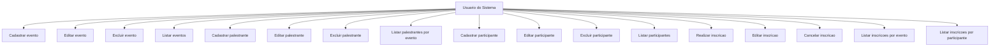

# DCU

```mermaid
flowchart TD
    Usuario[Usuario do Sistema]

    UC1[Cadastrar evento]
    UC2[Editar evento]
    UC3[Excluir evento]
    UC4[Listar eventos]

    UC5[Cadastrar palestrante]
    UC6[Editar palestrante]
    UC7[Excluir palestrante]
    UC8[Listar palestrantes por evento]

    UC9[Cadastrar participante]
    UC10[Editar participante]
    UC11[Excluir participante]
    UC12[Listar participantes]

    UC13[Realizar inscricao]
    UC14[Editar inscricao]
    UC15[Cancelar inscricao]
    UC16[Listar inscricoes por evento]
    UC17[Listar inscricoes por participante]

    Usuario --> UC1
    Usuario --> UC2
    Usuario --> UC3
    Usuario --> UC4
    Usuario --> UC5
    Usuario --> UC6
    Usuario --> UC7
    Usuario --> UC8
    Usuario --> UC9
    Usuario --> UC10
    Usuario --> UC11
    Usuario --> UC12
    Usuario --> UC13
    Usuario --> UC14
    Usuario --> UC15
    Usuario --> UC16
    Usuario --> UC17
```
