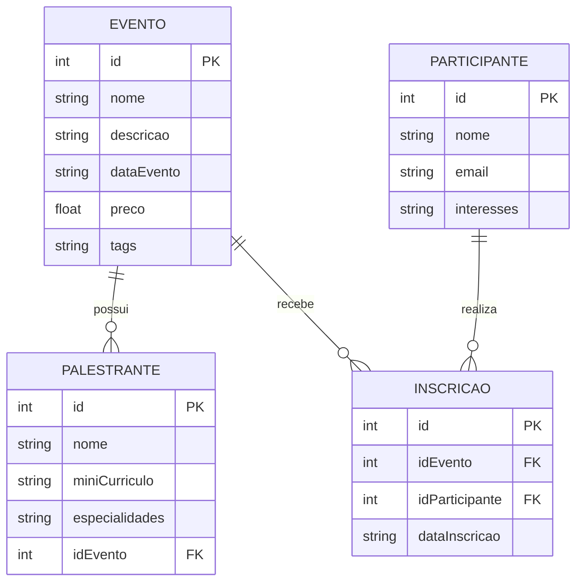

# DER

```mermaid
erDiagram
    EVENTO ||--o{ PALESTRANTE : possui
    EVENTO ||--o{ INSCRICAO : recebe
    PARTICIPANTE ||--o{ INSCRICAO : realiza

    EVENTO {
        int id PK
        string nome
        string descricao
        string dataEvento
        float preco
        string tags
    }

    PALESTRANTE {
        int id PK
        string nome
        string miniCurriculo
        string especialidades
        int idEvento FK
    }

    PARTICIPANTE {
        int id PK
        string nome
        string email
        string interesses
    }

    INSCRICAO {
        int id PK
        int idEvento FK
        int idParticipante FK
        string dataInscricao
    }
```
